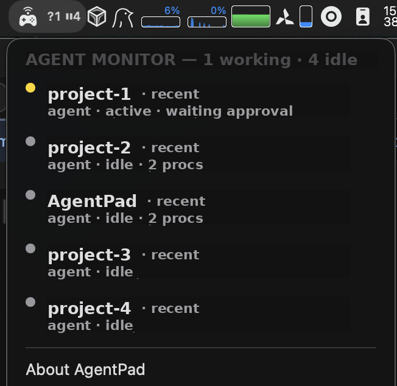

[日本語](lang/ja/README.md)

# AgentPad

**A menu bar HUD for your AI coding agents on macOS.**
See which agent is working, calling the model, or waiting for you — and approve / reject without taking your hands off the controller.



---

## What it does

You probably have three Claude / Codex / opencode sessions running right now. One is mid-task, one is streaming, one wants you to type `y`. You don't know which is which until you cycle through windows.

AgentPad turns that into a glance.

🟢  **Working** — running a tool or command
🟡  **Calling API** — streaming from the model
⚪  **Idle** — waiting for your input

Click the menu bar icon to see every agent: project, runtime, PID, current state. Sorted by who needs you most.


---

## Two halves

### 1. Monitor — zero config

Launch AgentPad. It finds every `claude` / `codex` / `opencode` process already running and starts showing dots. No accounts, no API keys, no network. Everything is read from local session files and (optionally) the visible Terminal text.

Add your own process patterns in Settings if you run something else.

### 2. Controller Remote — optional

Map a Joy-Con / Pro Controller / Famicom / SNES to keyboard shortcuts. The classic recipe:

| Button | Action |
| --- | --- |
| A | `y` (approve) |
| B | `n` (reject) |
| L / R | scroll diff |
| Start | `Ctrl+C` |

Per-app profiles switch automatically with the frontmost window. PlayStation, Xbox and MFi controllers can be marked Passthrough so games still see a native gamepad.

> Heads-up: Joy-Con / Pro Controller are seized in exclusive mode on macOS — they can't be shared with games while AgentPad is running. See [Known Limitations](#known-limitations).

---

## Install

1. Download `AgentPad-vX.X.X.dmg` from [Releases](https://github.com/rtx3/AgentPad/releases).
2. Drag `AgentPad.app` to `/Applications`.
3. Launch it once. Grant Accessibility when prompted.

Signed with Developer ID and notarized — Gatekeeper accepts it on the first launch, no right-click-Open required.


---

## Permissions, briefly

Accessibility powers two things:

- Reading the visible Terminal window (state fallback when an agent has no session file)
- Sending keystrokes from the controller

You can grant it on first launch, or skip it — Monitor still works in degraded mode (JSONL-only) and Controller is opt-in.

---

## Known Limitations

**Nintendo controllers can't be used in games while AgentPad is running.** AgentPad opens Joy-Con / Pro Controller in IOKit exclusive seize mode (the only way to get rumble + IMU + LEDs + full button set on macOS). Quit AgentPad, then power-cycle the controller or re-pair it, before a game can see it again.

PlayStation / Xbox / MFi controllers go through `GameController.framework` — a shared system path — so Passthrough works normally for them.

---

## Roadmap

- DualShock 4 / DualSense / Xbox / MFi support
- LED / rumble notification when an agent enters Idle
- Jump-focus the Terminal of a specific agent from the popover
- Sparkle 2 in-app updates
- Per-agent runtime statistics

Full plan: [docs/plan.md](docs/plan.md).

---

## Build from source

```sh
pod install
open AgentPad.xcworkspace
```

Build & run the `AgentPad` scheme. Requires Xcode and CocoaPods.

---

Backed by [JoyConSwift](https://github.com/magicien/JoyConSwift) for Nintendo controller IO.

Forked from [JoyKeyMapper](https://github.com/magicien/JoyKeyMapper) by [@magicien](https://github.com/magicien) — thanks for the original project that made this possible.
