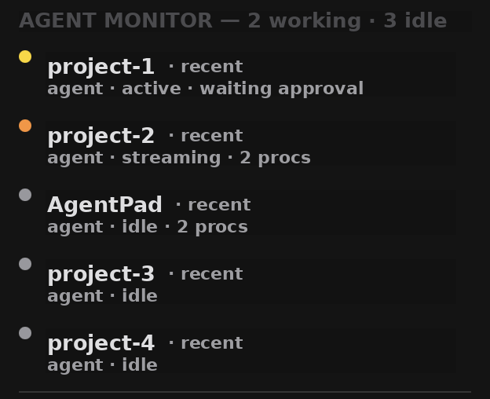

[English](../../README.md)

# AgentPad

**macOS の AI コーディングエージェント用、メニューバー HUD。**
どのエージェントが作業中か / モデル通信中か / あなたの入力待ちか — 一目で把握。そしてコントローラから手を離さずに approve / reject。


---

## できること

今あなたは Claude / Codex / opencode のセッションを 3 つくらい同時に動かしているはずです。1 つはツール実行の途中、1 つはストリーミング中、1 つは `y` の入力を待っている — ウィンドウを切り替えて確かめるまで、どれがどれか分からない。

AgentPad はそれを一瞥に変えます。

🟢  **Working** — ツール / コマンドを実行中
🟡  **Calling API** — モデルとストリーミング中
⚪  **Idle** — あなたの入力待ち

メニューバーアイコンをクリックすると、各エージェントのプロジェクト・稼働時間・PID・現状が見えます。あなたを最も必要としている順にソート。



---

## 2 つの面

### 1. Monitor — 設定不要

起動するだけ。すでに走っている `claude` / `codex` / `opencode` プロセスを見つけてドットを出します。アカウント不要、API キー不要、ネットワーク通信なし。状態はすべて、ローカルのセッションファイルと（任意で）画面に見えているターミナル文字から読みます。

他の AI ツールを使うなら、設定でプロセスパターンを追加できます。

### 2. コントローラリモコン — 任意

Joy-Con / Pro Controller / Famicom / SNES をキーボードショートカットにマッピング。定番の組み合わせ：

| ボタン | 動作 |
| --- | --- |
| A | `y`（approve） |
| B | `n`（reject） |
| L / R | diff スクロール |
| Start | `Ctrl+C` |

フロントアプリに応じてプロファイルが自動切替。PlayStation / Xbox / MFi コントローラは Passthrough 指定すれば、ゲームでは純正ゲームパッドとして振る舞います。

> 注意：Joy-Con / Pro Controller は macOS 上で **排他 seize モード** で開かれます — AgentPad 起動中はゲームと共有できません。詳細は [既知の制限](#既知の制限)。

---

## インストール

1. [Releases](https://github.com/rtx3/AgentPad/releases) から `AgentPad-vX.X.X.dmg` をダウンロード。
2. `AgentPad.app` を `/Applications` にドラッグ。
3. 一度起動し、アクセシビリティ権限を許可。

Developer ID 署名 + 公証済みのため、Gatekeeper は初回起動からそのまま受け入れます — 右クリック→開く の操作は不要です。


---

## 権限について

アクセシビリティ権限が必要な機能：

- 画面に見えているターミナルウィンドウの読み取り（セッションファイルを書かないエージェントの状態フォールバック）
- コントローラからのキーストローク送信

初回起動時に許可しても、後回しでも OK — Monitor は JSONL だけのデグラデーションモードでも動きますし、Controller はそもそもオプトインなので。

---

## 既知の制限

**AgentPad 起動中、任天堂コントローラはゲームで使えません。** AgentPad は IOKit 排他 seize モードで Joy-Con / Pro Controller を開きます（macOS 上で振動・IMU・LED・全ボタンを得られる唯一の経路）。ゲームから使い直すには、AgentPad を終了したうえで、コントローラの電源を入れ直すか Bluetooth から外して再ペアリングしてください。

PlayStation / Xbox / MFi コントローラは `GameController.framework` 経由（共有システム経路）のため、Passthrough が通常通り動きます。

---

## ロードマップ

- DualShock 4 / DualSense / Xbox / MFi 対応
- エージェントが Idle になったら LED 点滅 / 振動で通知
- Popover から特定エージェントのターミナルウィンドウへ一発フォーカス
- Sparkle 2 によるアプリ内自動アップデート
- エージェント単位の稼働 / 状態統計

全計画：[docs/plan.md](../../docs/plan.md)

---

## ソースからビルド

```sh
pod install
open AgentPad.xcworkspace
```

`AgentPad` スキームでビルド & 実行。Xcode と CocoaPods が必要です。

---

Nintendo コントローラの IO は [JoyConSwift](https://github.com/magicien/JoyConSwift) に依拠しています。

[@magicien](https://github.com/magicien) の [JoyKeyMapper](https://github.com/magicien/JoyKeyMapper) をフォークしたものです。本プロジェクトを可能にした原作に感謝します。
